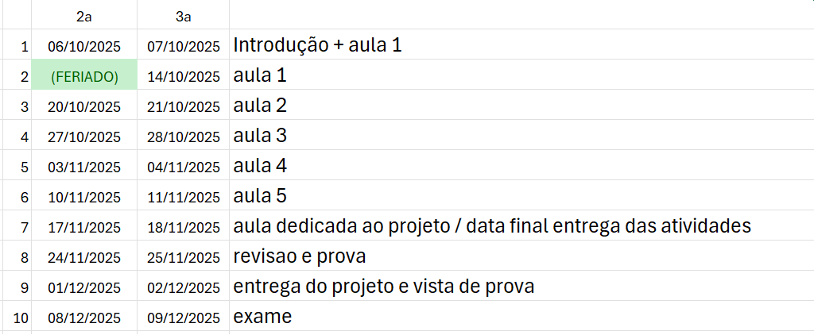

# **Algoritmos Evolutivos**

Algoritmos Evolutivos são técnicas de Inteligência Artificial inspiradas na evolução natural. Eles simulam o processo de seleção natural, onde indivíduos mais adaptados têm maior chance de sobreviver e se reproduzir, gerando novas soluções cada vez melhores para um problema.

# **Plano de Curso – Algoritmos Evolutivos **

**Estrutura de cada aula:**

* **Conceito (1h – 1h30)** → até concluir toda a teoria prevista.
* **Prática guiada (1h30)** → em aulas pares ou alternadas.
* **Projeto de bimestre (1h30)** → em aulas pares ou alternadas.

Depois que o conteúdo teórico estiver fechado, **todo o tempo será prática + projeto**.

## Critérios de avaliação

A nota final será composta pelos seguintes critérios:

| Componente                          | Peso |
| ----------------------------------- | ---- |
| Prova (conteúdo teórico e prático)  | 40%  |
| Projeto Final em Grupo              | 40%  |
| Atividades individuais              | 20%  |

## Cronograma de entrega das atividades

| Quando a atividade for entregue                   | Valor |
| --------------------------------------------------| ----- |
| No prazo                                          | 100%  |
| Atrasado até 18/11/2025                           |  70%  |
| Atrasado entre 19/11/2025 e 02/12/2025            |  50%  |

## Cronograma (pode haver alterações)

----

# Projeto

### [Sugestões de temas](./projeto/readme.md)
### *Grupos de 3 a 5 pessoas. (excessões podem ser discutidas)*

**A entrega será semelhante ao bimestre passado. **

O que deve constar na entrega:
| Item                                               |
| -------------------------------------------------- |
| 1. Vídeo explicando o trabalho                     |
| 2. Código fonte                                    |
| 3. Relatório dos experimentos                      |

## **Distribuição Aula a Aula**

### **Aula 1 (1h30 conceito + 1h30 prática)**

**Conceito:**

* Introdução: motivação, inspiração biológica, estrutura básica do AE.
* Aplicações reais.

**Prática:**

* Implementar busca aleatória em Python.
* Estrutura inicial do AE: população + fitness.

---

### **Aula 2 (1h30 conceito + 1h30 projeto)**

**Conceito:**

* Representação de soluções (binária, inteira, real).
* Função de fitness.
* População inicial.

**Projeto:**

* Formação de grupos.
* Escolha do caso de uso.
* Definição de representação + primeira ideia de fitness.

---

### **Aula 3 (1h30 conceito + 1h30 prática)**

**Conceito:**

* Seleção de indivíduos: roleta, torneio, ranking.
* Pressão seletiva.

**Prática:**

* Implementar seleção por roleta e torneio.
* Comparar diversidade/população.

---

### **Aula 4 (1h30 conceito + 1h30 projeto)**

**Conceito:**

* Crossover: 1 ponto, 2 pontos, uniforme, aritmético.
* Probabilidade de crossover.

**Projeto:**

* Implementar crossover no problema escolhido.
* Rodar primeiros testes.

---

### **Aula 5 (1h30 conceito + 1h30 prática)**

**Conceito:**

* Mutação (bit flip, gaussiana, troca).
* Parâmetros (população, crossover, mutação).
* Elitismo e convergência prematura.
* Critérios de parada.

**Prática:**

* Implementar mutação e elitismo.
* Testar diferentes taxas de mutação.

---
